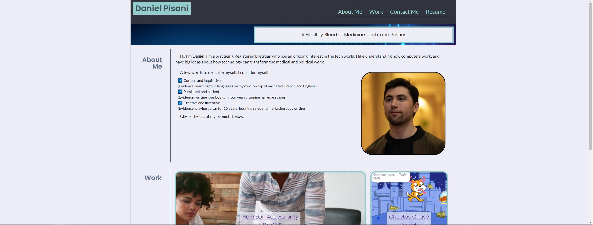

# Personal Portfolio

The following is a mock webpage of my (WellAndGood's) personal portfolio.
Last updated: June 14, 2021

This website is meant to demonstrate knowledge and competency in the following:

- The ability to follow a detailed user story,
- Building a webpage from scratch,
- Flexboxes,
- Media queries,
- Accessibility.

# Features

- Nav: Presents in a horizontal (left-right) format. When collapsed, it presents in a vertical (top-down) format.
- Body: set up in 3 rows of 2, formatted as a flexbox, which describe:
    - About Me (title and content)
    - Portfolio (title and content)
    - Contact information (title and content)
- Portfolio div: set up as a flexbox which arranges 5 clickable images.
- Contact div: features a nav which acts as a flexbox.
- Media queries: After the viewport reaches less than 992 and 768 pixels respectively, these act as breakpoints which re-arrange the divs (primarily as stacked columns instead of left-right orientation).
- **Note: The first two projects are actual projects, produced by the user (F34rTh3R34p3r). The last three projects serve as placeholders, which do not reflect of the user's abilities, and simply help to showcase the portfolio's flexbox.**

# File Architecture

File name | Function
------------ | -------------
index.html | HTML
assets/style/reset.css | CSS reset
assets/style/style.css | CSS stylesheet
assets/images | stock images in webpage
<pre>

</pre>
# Website Appearance 
Once loaded, the website should look like this:  

This website is available at the following URL:   https://wellandgood.github.io/portfolio-personal/ 

# Contributor(s)
Daniel Pisani (WellAndGood)

# MIT License

Copyright (c) 2021 Daniel Pisani (WellAndGood) 

Permission is hereby granted, free of charge, to any person obtaining a copy of this software and associated documentation files (the "Software"), to deal in the Software without restriction, including without limitation the rights to use, copy, modify, merge, publish, distribute, sublicense, and/or sell copies of the Software, and to permit persons to whom the Software is furnished to do so, subject to the following conditions:

The above copyright notice and this permission notice shall be included in all copies or substantial portions of the Software.

THE SOFTWARE IS PROVIDED "AS IS", WITHOUT WARRANTY OF ANY KIND, EXPRESS OR IMPLIED, INCLUDING BUT NOT LIMITED TO THE WARRANTIES OF MERCHANTABILITY, FITNESS FOR A PARTICULAR PURPOSE AND NONINFRINGEMENT. IN NO EVENT SHALL THE AUTHORS OR COPYRIGHT HOLDERS BE LIABLE FOR ANY CLAIM, DAMAGES OR OTHER LIABILITY, WHETHER IN AN ACTION OF CONTRACT, TORT OR OTHERWISE, ARISING FROM, OUT OF OR IN CONNECTION WITH THE SOFTWARE OR THE USE OR OTHER DEALINGS IN THE SOFTWARE.

